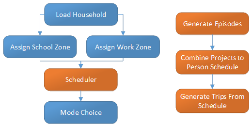
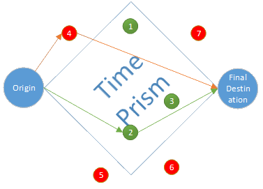

# Scheduler

## Overview

In GTAModel V4.0 the scheduler has the responsibility of generating trips, picking their destinations, and start-times.  In order to accomplish this the scheduler first builds up activity episodes.  At first the activity episodes are organized into projects by activity type.  After all of the activities are generated they are then scheduled into each person’s personal schedule.  After each person’s day has been scheduled trips are then created which can be processed by the mode choice algorithm to be assigned modes.

## Generate Episodes

The generation process of GTAModel V4.0 works on a fixed probability matrix populated from TTS.  The exact breakdown linking distribution number to the type of individual is given in the table below.  The process for generating an activity however is unified across the different types of activities.  Firstly, we generate the frequency of the activity type.  Secondly, given the frequency of the activity we generate a start time.  Lastly, given that start time we generate the activity’s duration.  If that start time and duration is feasible in the persons’ project’s schedule it is included otherwise a new start time and duration are generated.  This is attempted a number of times (default 10), and if no successful combination is found it will be thrown out.

All of the rates are read in from the file “~/ActivityDistributions/FrequencyDistributions.zfc” besides the number of adults contained in a joint episode while is in “~/ActivityDistributions/AdultDistributions.zfc”.  When calibrating models it is best to never touch these files as they have been generated using XTMF from the 2011 TTS.

The activity generation distributions are broken down into their 

## Combining Projects Into a Person Schedule

After all of the projects for the household have been developed they will need to be combined into a person schedule before being converted into trips.  The order in which a person schedule is developed depends if they are a student or not.  If they are a full-time student their school episodes are scheduled in first, otherwise work episodes are and then their school episodes.  At this point travel times between episodes are taken into consideration and location choices are being assigned as each episode is included.  After work and school have been added, household level episodes are included into the schedules, first other episodes then market episodes.  After the household activities have been added, individual other and market episodes are included.

During this process the activities start times are adjusted as needed in order to fit the episodes and if needed the duration is changes.  Durations cannot be modified to be less than fifty percent of their originally scheduled duration.

## Location Choice

### Overview

The location choice model for GTAModel V4.0 is separated into three sub models, Work-Based-Business, Market, and Other.  To be specific ‘Other’ is for the ‘Individual Other’ and ‘Joint Other’ activity types, and not everything besides work and market.  Probabilities are then generated for each time period based on the population and employment in the zone among other factors.  Later when producing person schedules the location choice model eliminates all infeasible zones and then pops a random location choice from the remaining probabilities.  A zone is considered infeasible if there is not enough from to get from the person’s pervious activity, do the current activity and then travel to their next activity in time.  For the location choice model the auto network travel time is used to calculate times.  Below is a diagram showing a time prism.  Here we can see that zones 1, 2, and 3 are viable candidates whereas 4, 5, 6, and 7 are not.  In the case of zone 4 is too far away from the destination since the travel time from origin to 4 plus the travel time from 4 to the final destination is greater than the time available.

## Generate Trip Chains

### Overview

There are two types of schedules in GTAModel V4.0.  The first is called a Project.  A Project contains all of the activity episodes for one larger type of activity.  For instance the Work Project contains all of the activity episodes with respect to Primary Work, Return-From-Work, and Work-Based-Business.  The second type of schedule is called the Person Schedule.  This schedule is the one that will represent the activities for the given day.  It is produced by combining the project’s schedules together, adjusting them as needed.
Each person in the model starts building their day’s activities by putting together their projects.  There are four different personal projects, Work, School, individual other, and individual market.  In addition there is a household level project for joint activities.

Once all of the projects have been generated person schedules are built by taking the activity episodes from the project schedules and combing them.  First work and school episodes are added, first work if they are primarily a worker otherwise school episodes.  After that household level episodes are included, then finally individual market and other episodes.  As activities are being added into the person’s schedule locations are chosen for the activities.

After the all of the person schedules in the household are completed trips are then generated for processing by the mode choice.  These trips are broken into trip chains, where a trip chain ends when a person returns home.  Since there is no activity (besides return home from work / lunch) where a person would go home, if a person could return home from their current position at the end of an activity and be home for over 15 minutes a return home activity is generated, and thus ends the trip chain.

## Distributions

There are ten different activity types that the Scheduler can produce from its 262 different distributions:
  * Primary Work
  * Secondary Work
  * Work Based Business
  * Work At Home Business
  * School
  * Return From Work
  * Individual Other
  * Joint Other
  * Market
  * Joint Market

The following sections will give the formulas to interpret the distribution id numbers mapping them onto the circumstances of the schedule and demographics of the person.

#### Lookup Table Values

The following tables give the conversions for the variables in the formulas to convert an activity to its distribution id number.

| School Age Offset | Range |
|-------------------|-------|
| 0                 | <= 15 |
| 1                 | <= 18 |
| 2                 | <= 25 |
| 3                 | <= 30 |
| 4                 | else  |

| Non-School Age Offset | Range |
|-----------------------|-------|
| -1                    | < 11  |
| 0                     | < 18  |
| 1                     | < 26  |
| 2                     | < 65  |
| 3                     | else  |

| Occupation Offset | Type          |
|-------------------|---------------|
| 0                 | Office        |
| 1                 | Manufacturing |
| 2                 | Professional  |
| 3                 | Retail        |

| Work Project Status | Type                              |
|---------------------|-----------------------------------|
| 0                   | NoWorkOrSchool                    |
| 1                   | FullTimeNoEveningWorkOrSchool     |
| 2                   | FullTimeEveningWorkOrSchool       |
| 3                   | FullTimeDayAndEveningWorkOrSchool |
| 4                   | PartTimeDay                       |
| 5                   | PartTimeEvening                   |
| 6                   | Other                             |

| Adult Offset | Range |
|--------------|-------|
| 0            | 1     |
| 1            | 2     |
| 2            | else  |

| Child Offset | Range |
|--------------|-------|
| 0            | 0     |
| 12           | else  |

#### Activity Generation ID Formulas

##### Primary Work
\begin{equation}
id = (ageOffset * 8) + occupationOffset * 2 +
\begin{cases}
1, & EmploymentStatus = FullTime \\\\
0, & else
\end{cases}
\end{equation}

##### Secondary Work

\begin{equation}
id = 32 + occupationOffset * 2 +
\begin{cases}
1, & EmploymentStatus = FullTime \\\\
0, & else
\end{cases}
\end{equation}

##### Work Based Business

\begin{equation}
id = 40 + (ageOffset * 8) + occupationOffset * 2 +
\begin{cases}
1, & EmploymentStatus = FullTime \\\\
0, & else
\end{cases}
\end{equation}

##### Work At Home Business

\begin{equation}
id = 72 + occupationOffset * 2 +
\begin{cases}
1, & EmploymentStatus = FullTime \\\\
0, & else
\end{cases}
\end{equation}

##### School

\begin{equation}
id = 84 + (ageOffset * 2) + occupationOffset
\end{equation}

##### Return From Work

\begin{equation}
id = 94 + occupationOffset * 2 +
\begin{cases}
1, & EmploymentStatus = FullTime \\\\
0, & else
\end{cases}
\end{equation}

##### Individual Other

\begin{equation}
id = 102 + ( ageOffset * 12 ) + workProjestStatus +
\begin{cases}
6, & Female \\\\
0, & else
\end{cases}
\end{equation}

##### Joint Other

\begin{equation}
id = 158 + ( baseOffset + childOffset ) + ( adultOffset * 4 ) + statusOffset
\end{equation}

##### Market

\begin{equation}
id = 182 + ( ageOffset * 14 ) + workProjestStatus +
\begin{cases}
7, & Female \\\\
0, & else
\end{cases}
\end{equation}

##### Joint Market

\begin{equation}
id = 238 + ( baseOffset + childOffset ) + ( adultOffset * 4 ) + statusOffset
\end{equation}
