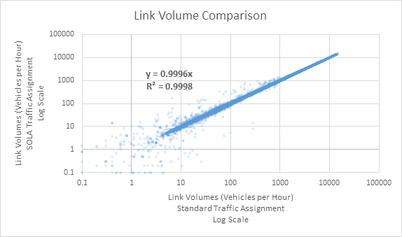

# Auto Assignment

## Overview

GTAModel V4.0 uses a Static User Equilibrium (SUE), single-class traffic assignment procedure implemented in Emme 4.1/4.2. Road tolls (e.g., the 407 ETR) are included as a generalized cost, and converted to perceived minutes using a Time Value of Money (TVALM) parameter. This model is nearly identical to other traffic assignment models commonly in-use around the region, save for minor implementation details. 

## Assignment Parameters

Two route major parameters needed to be calibrated for the auto assignment: the peak hour factor, and the toll perception factor.

### Peak Hour Factor

For assignment, trips are aggregated over several hours (e.g. 3 hours for the AM peak period), but must be factored down into a single peak hour for assignment.

| Time Period | Peak Hour Factor |
|-------------|------------------|
| AM          | 0.437            |
| Mid-Day     | 0.1667           |
| PM          | 0.385            |
| EV          | 0.2              |
| ON          | 1                |

## Outputs

The traffic assignment procedure produces three output matrices: auto in-vehicle travel time (AIVTT), OD average trips costs (in $), and OD average trip tolls (also in $). The auto costs matrix encompass several per-km components of auto ownership costs, including gasoline and maintenance. See the Input section below for more details.

## Inputs

### Road Tolls

In 2011, Highway 407 was the only road with tolls on it in the model area. 407ETR (the company which has leased the road) uses a per-km toll, changing by time-of-day, by vehicle-class, and by location: a ‘light’ fare zone running from Hamilton to the Highway 403 interchange in Oakville, and a ‘regular’ fare zone across the remaining highway.   Table 2 407 toll rates details the fare amounts, which were blended in order to apply them to the model time periods which differ from those used by the tolling company. 

### Link Costs

Trip average costs are stored in a link attribute, and aggregated to the OD during the assignment. The per-link value used in the base model is `$0.153/km` and includes:

* 10.12 ¢/km gasoline cost
* 3.11 ¢/km maintenance cost
* 2.11 ¢/km tire replacement

### Demand Matrices

Base matrices for the model – used to calibrate the assignment model – were extracted from the 2011 TTS. Auto driver and motorcycle trips were included, but not taxi or auto passenger trips. 

## SOLA VS. Standard Traffic Assignment

Emme 4.1 introduced a new implementation of the Standard Traffic Assignment procedure used in previous versions; this new version is referred to as SOLA: Second-Order Linear Approximation. The SOLA Traffic Assignment procedure converges in fewer iterations compared to the Standard procedure (resulting in faster model performance) making it an attractive option for this model.

The SOLA tool was compared against the Standard tool to ensure consistency of results. The two tools were run to the same convergence criterion: relative gap of 10-3, which SOLA reached in 70 iterations compared to the Standard tool’s 145 iterations. OD travel times were identical; when plotted on a scatterplot the resulting linear REGULARression had a slope of 1.0 and an R2 of 1.0. This is expected, given that both traffic assignments strive to equilibrate travel times across all paths for each OD pair. Volumes on links were also plotted on a scatterplot (see Figure 14 a comparison between SOLA and traditional road assignment on links). The overall consistency is good with a slope of 0.9996 and an R2 of 0.9998, with higher-volume links showing better convergence than lower-volumes ones. This result is expected, since the two procedures converged to slightly different solutions of link flows. 

