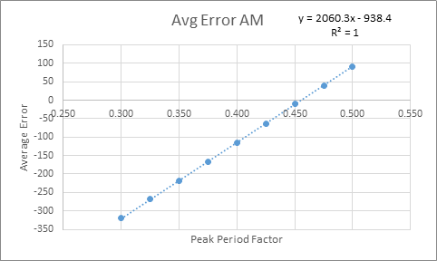
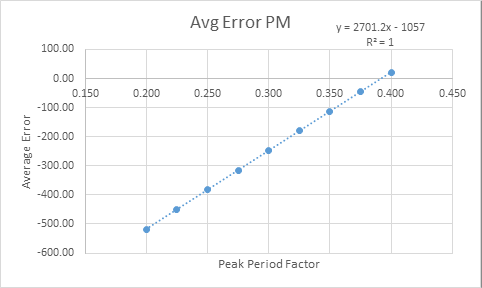
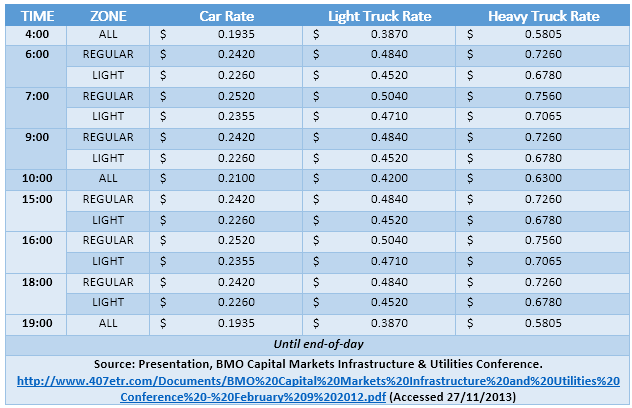

# Auto Assignment

## Overview

GTAModel V4.0 uses a Static User Equilibrium (SUE), single-class traffic assignment procedure implemented in Emme 4.1/4.2. Road tolls (e.g., the 407 ETR) are included as a generalized cost, and converted to perceived minutes using a Time Value of Money (TVALM) parameter. This model is nearly identical to other traffic assignment models commonly in-use around the region, save for minor implementation details. 

## GTAModel V4.1

### Preparation of Input Data

All counts for all stations and screenlines for auto vehicles, light trucks, medium trucks, and heavy trucks were obtained from CCDRS in 15 minute windows. A python script was then run in order to determine the peak hour using a rolling hour window for each time period. This was done for both screenlines and stations. Stations were mapped to screenlines based on data obtained from DMG. The stations were also mapped to stations in the Emme Network.
The Emme Network was updated to 2016 and the collector and express were split on the highways that used a core collector system (401, 403, 404). The 407 Tolls were also updated with the 2016 values. 
For heavy truck restrictions, new restrictions were updated where possible, but improvements focused mainly on Toronto, Peel Region, and Hamilton. The network still resulted in connectivity issues for heavy vehicles, so certain centroids had to have special connectors that contained only the heavy truck mode and connected to the nearest road that allowed heavy trucks. The capacity on the highways and ramps were also bumped up by 10% in order to remove the restriction that was in place as a zero order approximation. (e.g. 1800 pcu/hour/lane to 2000 pcu/hour/lane).

### Peak Hour Factor Auto

When finding the Peak Hour Factors for the AM and PM time periods for auto, and a $0.067603/km charge with a $50/hour value of time. Various different Peak Period Factors were then tested out. For each Peak Period
Factor the following was done

\begin{equation}
\Delta_x = (\text{Emme Volume})_x - (\text{Observed Peak Hour Volume in Time Period})_x
\end{equation}

Where \\( x \\) is a countpost.

\begin{equation}
\text{Average Error} = \dfrac{\sum_{x}{\Delta_x}}{\text{Count}(\Delta_x)}
\end{equation}

This was then plotted on a graph for both the AM and the PM, shown below in Figure 1 and Figure 2. The point at which the Average Error
is 0 is then taken to be the Peak Period Factor. 

#####_Figure 1 - Average Countpost Error based on PPF in the AM_

#####_Figure 2 - Average Countpost Error based on PPF in the PM_

The peak hour factor from this method was found to be 0.46 and 0.39 for the AM and PM respectively. When comparing these numbers to the 2016 TTS Trip starts,
 they seem to get AM correct but the PM appears to be too high. For comparison, the TTS peak hour factors which were 0.469 and 0.307. This is likely due to
 the known under-reporting of non-work, non-school trips in the 2016 TTS. In the AM time period, most of the trips are work based, so the demand provides good results when
 compared to the stations counts. However, in the PM due to the under-reporting of TTS, the Peak Hour Factor is forced to be higher in order to try to match the counts from the count posts.

### Peak Period Factor and Peak Hour Factor Freight

Since the freight model only provides freight demand data for a 12.5 hour period, it was necessary to break it in to time periods and peak hours for each time period in order to assign the freight into Emme.
Table 2 summarizes the calculations that were done.

#####_Table 2 - Freight factors_

| Adjustment Factors              |          |          |          |
|---------------------------------|----------|----------|----------|
| Vehicle   Class                 | Light    | Medium   | Heavy    |
| 12.5 Factor   (06:30-19:00)     | 0.78     | 0.78     | 0.66     |
| Off Peak   Factor (19:00-06:30) | 0.22     | 0.22     | 0.34     |
| Off Peak   Factor Per Half Hour | 0.009565 | 0.009565 | 0.014783 |
| 13 Hour   Factor (06:00-19:00)  | 0.789565 | 0.789565 | 0.674783 |
| AM Factor   (06:00-09:00)       | 0.185851 | 0.159685 | 0.135086 |
| MD Factor   (09:00-15:00)       | 0.355817 | 0.423595 | 0.364802 |
| PM Factor   (15:00-19:00)       | 0.247897 | 0.206285 | 0.174895 |
| EV Factor   (19:00-23:59)       | 0.095652 | 0.095652 | 0.147826 |
| AM PHF                          | 0.375068 | 0.419648 | 0.362608 |
| MD PHF                          | 0.177191 | 0.171329 | 0.176942 |
| PM PHF                          | 0.284042 | 0.325995 | 0.317223 |
| EV PHF                          | 0.2      | 0.2      | 0.2      |

The 12.5 Hour Factor is given by the Freight Model, the documentation for which is also provided. Uniform distribution is assumed to occur in the Off Peak Period from 19:00-06:30. This uniform distribution is
 then used to find a 13 hour factor that neatly fits into the AM, MD, and PM Time Periods of GTAModel. The time period factor for AM, MD, and PM was then found by multiplying the 13 hour factor by the sum
 of the number of vehicles in the time period divided by the total number of trucks in the 13 hours. The EV time period happens in the Off Peak time period so is assumed to have uniform distribution.
 The Off Peak Factor per Half Hour was multiplied by 10 (for the 5 hour EV period) in order to obtain EV Factor.

The Peak Hour Factor (PHF) for trucks was found using the count station data. A simple rolling hour window was used to find the maximum volume
 in an hour for each time period. This was then divided by the sum of the volume of the volume in the time period in order to obtain the Peak Hour Factor (PHF). 

### Toll Perception Estimation Framework

The model system was set up with the 2016 407 tolls but no link costs in order to estimate the Toll perception factor in $/hr for each vehicle class.
 A higher Toll Perception Factor means that the toll cost does not matter much, while a lower perception means that the cost matters a lot. The perception parameter was 
fixed to be the same for both AM and PM and was allowed to float between $15/hr and $100/hr. 

The fitness function was set up using the following formula

\\( \text{Fitness} = 0.49\text{AM} + 0.33\text{PM} \\)

Where

\begin{equation}
\text{Period} = \dfrac{\text{Sum}(Error Auto)}{\text{Count}(Error Auto)} + \dfrac{\text{Sum}(Error Light)}{\text{Count}(Error Light)} + \dfrac{\text{Sum}(Error Medium)}{\text{Count}(Error Medium)} + \dfrac{\text{Sum}(Error Heavy)}{\text{Count}(Error Heavy)}
\end{equation}

\begin{equation}
Error = (Observed - Modelled)^2
\end{equation}

The error was calculated for each station, summed up for each time period, and divided by the number of stations in that time period to obtain the fitness. A lower fitness value implies a better model,
 with 0 being a perfect model. The same method was done for the PM time period.

### Initial Results

The results from the run showed that the lowest fitness for this was found to be 1193. There was not too much variation between even the lowest perceptions and the highest perception.
There were some trends though, Auto perception generally found that being in the mid $30/hour range to minimize the error. Light trucks showed the highest Value of Time which would make
sense as they carry professional workers. Medium and Heavy vehicles show values that are a little higher than auto. 

### TTS Peak Hour Factors

During this process, there was discussions regarding a new PM model for GTAModelV4.1 which would help to fill in the missing TTS trips during that time period. This would lead to the Peak Period Factors as currently
calculated to be too peaky for the PM since new demand would be added and therefore the model would be able to hit counts without bumping up the Peak Hour Factors. This led to a new estimation run with the TTS
Peak Period Factors being used instead of the ones calculated in the method above for Auto vehicles only.

The results for this show similar results as compared to the first model. The distribution pattern of Auto, Medium and Heavy vehicles being in a similar range with only light commercial vehicles being higher
also held in this estimation.  The lowest fitness result was 1188, which is slightly lower than the first model, but the difference in value is very minor. In this model however, light commercial vehicles
seemed to have a preference for a significant increase in the VOT while the other classes showed smaller increases.

### Summary

In order to calibrate the new auto assignment with freight, input data was collected for auto vehicles and freight vehicles from transit counts. These counts were used to establish the Peak Period Factors as
well as the Peak Hour Factors for freight vehicles. Two different models were then evaluated, one with Peak Hour Auto Factors from count station and Emme data, and the other with TTS auto Peak Hour Factors. 

Both of these models shared similarities especially with regards to the pattern of perception values that show better results. Further analysis of the results show that while there are definitely **wrong**
peak period factors, there appears to be a valid range in the values that can be used. Overall there was not too much difference between the worst performing numbers and the highest performing numbers
in terms of its Root Mean Squared Error fitness values.  

After discussions, it was decided to use the Peak Period Factor from TTS due to the possible future inclusion of the PM model into GTAModelV4.1. The chosen set of parameters, while not the lowest fitness value,
was one that was felt to be the most reasonable set of values that performed well as well. The values were  $50.99/hour, $76.02/hour, $37.96/hour and $67.06/hour for Auto, Light, Medium, and Heavy vehicles respectively.
This corresponded to a fitness value of 1192.488.

## GTAModel V4.0

### Assignment Parameters

Two route major parameters needed to be calibrated for the auto assignment: the peak hour factor, and the toll perception factor.

#### Peak Hour Factor

For assignment, trips are aggregated over several hours (e.g. 3 hours for the AM peak period), but must be factored down into a single peak hour for assignment.

| Time Period | Peak Hour Factor |
|-------------|------------------|
| AM          | 0.437            |
| Mid-Day     | 0.1667           |
| PM          | 0.385            |
| EV          | 0.2              |
| ON          | 1                |

### Outputs

The traffic assignment procedure produces three output matrices: auto in-vehicle travel time (AIVTT), OD average trips costs (in $), and OD average trip tolls (also in $). The auto costs matrix encompass several per-km components of auto ownership costs, including gasoline and maintenance. See the Input section below for more details.

### Inputs

#### Road Tolls

In 2011, Highway 407 was the only road with tolls on it in the model area. 407ETR (the company which has leased the road) uses a per-km toll, changing by time-of-day, by vehicle-class, and by location: a ‘light’ fare zone running from Hamilton to the Highway 403 interchange in Oakville, and a ‘regular’ fare zone across the remaining highway.   Table 2 407 toll rates details the fare amounts, which were blended in order to apply them to the model time periods which differ from those used by the tolling company. 

#### Link Costs

Trip average costs are stored in a link attribute, and aggregated to the OD during the assignment. The per-link value used in the base model is `$0.153/km` and includes:

* 10.12 ¢/km gasoline cost
* 3.11 ¢/km maintenance cost
* 2.11 ¢/km tire replacement

#### Demand Matrices

Base matrices for the model – used to calibrate the assignment model – were extracted from the 2011 TTS. Auto driver and motorcycle trips were included, but not taxi or auto passenger trips. 

### SOLA VS. Standard Traffic Assignment

Emme 4.1 introduced a new implementation of the Standard Traffic Assignment procedure used in previous versions; this new version is referred to as SOLA: Second-Order Linear Approximation. The SOLA Traffic Assignment procedure converges in fewer iterations compared to the Standard procedure (resulting in faster model performance) making it an attractive option for this model.

The SOLA tool was compared against the Standard tool to ensure consistency of results. The two tools were run to the same convergence criterion: relative gap of 10-3, which SOLA reached in 70 iterations compared to the Standard tool’s 145 iterations. OD travel times were identical; when plotted on a scatterplot the resulting linear REGULARression had a slope of 1.0 and an R2 of 1.0. This is expected, given that both traffic assignments strive to equilibrate travel times across all paths for each OD pair. Volumes on links were also plotted on a scatterplot (see Figure 14 a comparison between SOLA and traditional road assignment on links). The overall consistency is good with a slope of 0.9996 and an R2 of 0.9998, with higher-volume links showing better convergence than lower-volumes ones. This result is expected, since the two procedures converged to slightly different solutions of link flows. 

