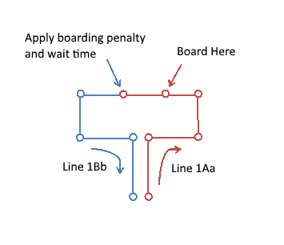
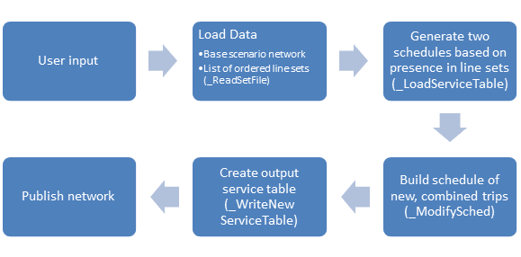

# Looped Line Conjoining Report

## Motivation

The city requested that we look into the problem of loops in lines in the network. The identified problem is that a person boarding or alighting within a loop may end paying an unrealistic transfer penalty and extra wait time to continue around the loop on what is actually the same line. The concept is illustrated below. 

It was hypothesized that performing this work may also have the added benefit of cleaning up some of the severely fragmented transit networks (particularly the TTC).

## Line Set Conjoiner

A tool, Line Set Conjoiner, was built to address this problem. Line Set Conjoiner works using two major data sets, the EMME transit network and the Combined Service Table in addition to a user-created list of line sets. A diagram of the broad algorithm is presented below. 

_ModifySched_ is the heart of the tool. For every line set passed in, it joins lines (by calling _ConcatenateLines_) and appends new trips to the new service table. Line concatenation is a relatively simple process. First, a new ID is generated for the line. The ID will have the next available for that (real-life) line, with c as the directional indicator. For example, if T001Ab and T001Ba are being conjoined (and no other T001__ lines exist), the new ID will be T001Cc. The next step is to pass the lines and the new ID into lineConcatenator (in TMG utilities). This tool looks up the itineraries for each line and makes sure that they line up at their joining ends. Then, it creates a new line with a combined itinerary, copying all attributes from the old segments, lines, etc. The old lines are not deleted. The new situation looks like below:

If concatenation is successful, _ModifySched_ continues onto the schedule modification. For every trip of the starting line, it will attempt to find a trip of the next line that matches up. Specifically it looks for the next trip departure that is within the inputted buffer period of the current arrival. Starting with sorted schedule data allows us to quickly eliminate trips that cannot be paired. Those are set aside to be put into the new service table under their original line name. This procedure means that overall link headways are preserved, although it also means that overall base network transit lines are more numerous. In practice though, time period networks don’t exhibit a large increase in lines.

The new service table is built from the following elements:
* Trips not relevant to the lines in the line set list
* New trips generated by _ModifySched_
* Trips skipped over during new trip generation in _ModifySched_
* Remnants of failed trip generation in _ModifySched_

Full source code is available on [GitHub](https://github.com/TravelModellingGroup/TMGToolbox/blob/dev-1.5/TMGToolbox/src/network_editing/line_set_conjoiner.py).

## Input Creation

Line Set Conjoiner works with any network that follows general NCS11 transit line naming and has a combined service table. Creating the line set list is the hard part and requires a great deal of “best judgement”. The set list specifies which lines match with each other and in what order. 

### General Procedure

There was a general procedure followed to build this list for the project. Michael Hain’s spreadsheet of paired lines was used as a starting point. For a given pair/set of lines, the combined service table is then examined to see how the schedules line up. If there is an obvious order to the schedule, then that order is entered into the line set list. If both directions seem equally viable, the network is consulted to check for loops at either end. The general goal is to keep the start/end node of the new line at the opposite end from the largest loop. In some suburban areas, loops at either end make this difficult. It is less common in Toronto, where there is almost always a subway station at one end. In some cases, the schedules seem independent in each direction. If this happens, it is wise to see if the line pairs were chosen incorrectly. In some other cases, the order is obvious, but the layover time at the end is very long. We have used 5 minutes as our buffer time in order to avoid introducing large speed errors into the equation. Typically, we have not included lines with long layovers in the line set list in order to keep things relatively tidy. Once a provisional line set is constructed, the tool is run and errors are examined. Revisions can be then be made.

### Problems Faced in Set List Construction

The existing service table and network are extremely complex. Vehicles often come from far away garages and enter service where convenient. In some jurisdictions, this means that short stub lines exist in the data. These are often difficult to deal with, as finding continuity between lines is not always obvious. 

In other cases, two different AM/PM lines pair with the same full-day line in the opposite direction. The tool cannot handle this, so it must be run a second time with any “duplicate” line sets listed in the second file. The user must be careful to select the updated service table as the input on the second iteration.

Another common issue, especially in Toronto, is that lines often have their schedule layovers at the looped end of the line. In this situation, it is a judgement call on how to join the lines. A big layover negates the looping problem, at least somewhat. Again, we have kept with the idea that 5 minutes is a reasonable maximum layover time. If the schedule matches in the “wrong” direction and there is no sub-5 minute match in the “correct” direction, then the line is paired in the wrong direction, mainly for the sake of tidiness. In Toronto, the general decision flow was:

* Start from a subway station. If that order is the best match, choose it.
* If there is no loop on the line (or if there are subway stations at each end), choose the order with the best schedule match.
* If there is a loop and a reasonably good match starting from the station, choose it.
* If there is only a good match in the “wrong” direction, choose it.
* If no good matches, don’t pair.

Often, schedules may match for parts of the day, but not others. The goal is to maximize the match, with peak period matches taking priority. Again, this can be a judgement call. If schedules only match for a couple of hours here and there, they are typically not listed as concatenation candidates.

With all these issues to consider, building a line set list becomes a very labour-intensive process, and does not have a reasonable chance at being automated at present. The current line set list can be seen as a work in progress, but has been considered quite closely and is adequate for the model re-estimation.

## Known Issues

Issues with the input service table are already documented above and are difficult to avoid. The service table is our best idea of how operation occurs on a day-to-day basis. There may be cleaner approaches to building up the headways, but that isn’t an option at present. The line set list we have now is our best attempt at resolving the looping problem. It doesn’t fix the overall glut of lines, but after applying Create Transit Time Period, the situation does not become much worse either. It also doesn’t resolve the looping problem globally, only where possible.

One known consequence of the concatenation procedure is the forward shifting of trips. As it stands, a trip that straddles a time period boundary will be counted in the first period when applying Create Transit Time Period (e.g. trip (8:40, 9:40) will be counted in the AM peak period). Since the concatenation procedure lengthens trips, this effect is broader, and can lead to more pronounced headway peaking, especially in the morning.

A known minor issue with the tool is that new lines inherit the description of the first line in the set, instead of matching the new ID in some way. 

## Potential Future Work

This procedure is not the only way that one could approach the looping problem. Another way would be to completely regenerate the transit schedule into a simpler table. The downside to this is the loss of one-to-one real world matching. A further option is develop a method of changing how transfers are handled in the V4 FBTA hypernetwork. One suggestion is to mark nodes within loops 

## Summary

We constructed a tool called Line Set Conjoiner that joins sets of given transit lines into new transit lines. The tool builds a new service table by joining trips corresponding to the newly conjoined transit lines. We believe the tool to be solid. However, the reality that we are attempting to match is not “clean”; transit lines don’t form neat loops, instead being constructed sometimes of one-way service entries and exits. The garbage in, garbage out concept applies here, as a great deal of human inspection and decision-making is required to build the line set list that serves as input to the tool. Regardless, this approach does seem closer to a true representation than before, as the problem with large end loops is solved for the majority of cases. Now, GTAModel V4 must be recalibrated to account for recent changes to transit lines (both this effort and earlier efforts to reform headway calculations).

