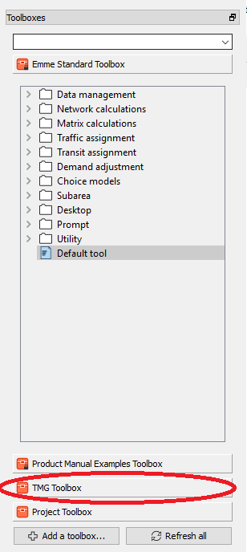

# Import Network Package

This tool allows the user to import a network into Emme using an NWP file (network package file)

## Opening the Tool with Modeller
---
This module can be found in Emme Modeller. Navigate to "TMG Toolbox" -> "Input Output" -> "Import Network Package". Double click the module to open it in Emme Modeller. 

1. Open Emme Modeller

2. Navigate to TMG Toolbox

3. Open Import Network Package tool

## Using the Tool with Modeller

### Network Package File

Under "Network Package File", click "Browse" to open the file explorer and navigate to the Network Package (NWP) file that you wish to import into the scenario. 

> An NWP file is a zip file that contains all the information in an Emme Network including the results of an assignment. It does not contain the strategies used in the transit assignment however.  NWP files can be "unzipped" using a software package like "7zip" or even windows (by changing the extension from ".nwp" to ".zip". After unzipping, the individual files can be examined or even modified according to the end users goals. The files can be then be "zipped" again and the extension changed back to ".nwp" for use in the tool. Manually editing the files in this manner is only recommended for advanced users.
> An NWP file at minimum contains the following:
> version.txt
> info.txt
> base.211
> functions.411
> modes.201
> shapes.251
> transit.221
> turns.231
> vehicles.202
> 
> The following are extra attribute related files which are optional
> exatts.241
> exatt_transit_lines.241
> exatt_segments.241
> exatt_nodes.241
> exatt_links.241
> 
> The following are assignment results related files which are optional
> aux_transit_results.csv
> link_results.csv
> segment_results.csv
> turn_results.csv

### New Scenario Number
Under "New Scenario Number", the scenario number that you want to import the network into can be entered. This scenario number can be one that is already defined in the project or a new scenario altogether
>If the scenario is already defined in the project, select the number and then click away to expose the "Overwrite Scenario" option. Since the scenario is already defined, the option will need to be selected in order to overwrite the defined scenario with the imported Network Package

### Scenario Description
The "Scenario Description" allows the scenario name to be selected.

### Function Conflict Option
The "Function Conflict Option" describes how to reconcile the functions present in the project with the new functions that are present in the network package that is being imported. For example if 'fd1' is already defined in the project as "length * 60/ul2", but in the NWP, function 'fd1' is defined as "length * 60/ul3", this tells the module how to handle these conflicts. In all options, functions that do not have a conflict will be added.
#### Edit Option
This opens a GUI which shows all the functions that have conflicts. It shows both the function in the Emme Project and the function in the NWP. It then allows the user to select which one they want to keep.

#### Raise Option
This stops the tool if any conflicts are found

#### Preserve Option
This keeps the functions as defined in the Emme Project if any conflicts exist

#### Overwrite Option
This overwrites any function defined in the Emme Project with the function in the NWP if a conflict exists. 

## Using the Tool with XTMF
The tool is called "ImportNetworkPackage". It is available to add under ExecuteToolsFromModellerResource or EmmeToolsToRun.
### Add functions
This flag allows the user to specify whether they want to add functions (including non conflicting ones) on import
### Function Conflict Option
The "Function Conflict Option" describes how to reconcile the functions present in the project with the new functions that are present in the network package that is being imported. For example if 'fd1' is already defined in the project as "length* 60/ul2", but in the NWP, function 'fd1' is defined as "length * 60/ul3", this tells the module how to handle these conflicts. In all options, functions that do not have a conflict will be added.

#### Raise Option
This stops the tool if any conflicts are found

#### Preserve Option
This keeps the functions as defined in the Emme Project if any conflicts exist

#### Overwrite Option
This overwrites any function defined in the Emme Project with the function in the NWP if a conflict exists. 

### Scenario Id
The scenario number in which to import the network package into. If the scenario is already defined, it will overwrite it. If it is not defined, then it will be created. 

### Scenario Name
The name of the scenario that will have the network package can be defined here. 
### Network Package
The location of the stored network package file (NWP) should be defined here using the appropriate modules.

